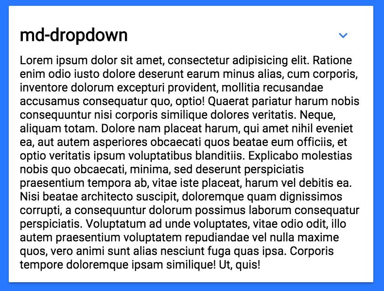

## &lt;md-dropdown&gt;
A Polymer element to hide sections of content

-[_DEMO_](http://leonardschuetz.ch/storage/stuff/polymer/md-dropdown/)


__Usage:__
```
<md-dropdown heading="Card title">
	Lorem ipsum dolor sit amet, consectetur adipisicing elit. Rem quas error ducimus, veniam, optio voluptatibus nostrum eum distinctio consequuntur adipisci.
</md-dropdown>
```
Set the title of the card in the _heading_ property. The other content goes in between the tags.
```
<md-dropdown heading="Card title" open>
	Lorem ipsum dolor sit amet, consectetur adipisicing elit. Rem quas error ducimus, veniam, optio voluptatibus nostrum eum distinctio consequuntur adipisci.
</md-dropdown>
```
The element is closed by default, if you want it to be already open at the beginning, set the _open_ property
```
<md-dropdown heading="Card title" nomargin>
	Lorem ipsum dolor sit amet, consectetur adipisicing elit. Rem quas error ducimus, veniam, optio voluptatibus nostrum eum distinctio consequuntur adipisci.
</md-dropdown>
```
The element has _8px of margin_ by default on the top and bottom. Remove this margin by adding a _nomargin_ property.
